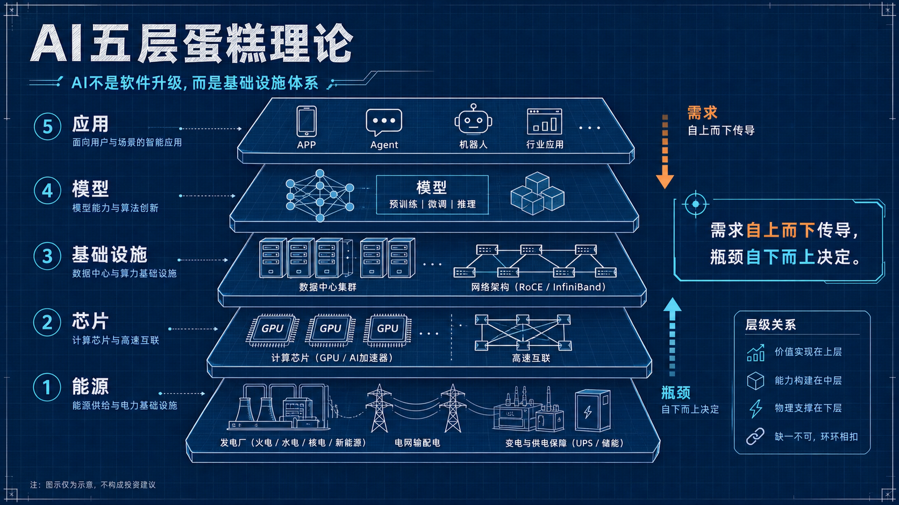
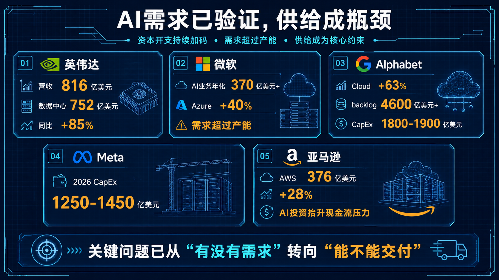
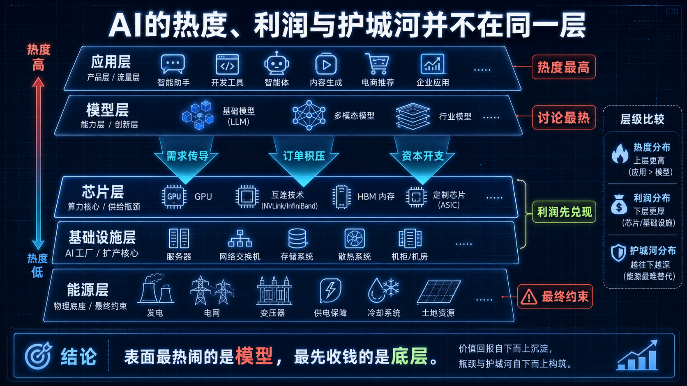
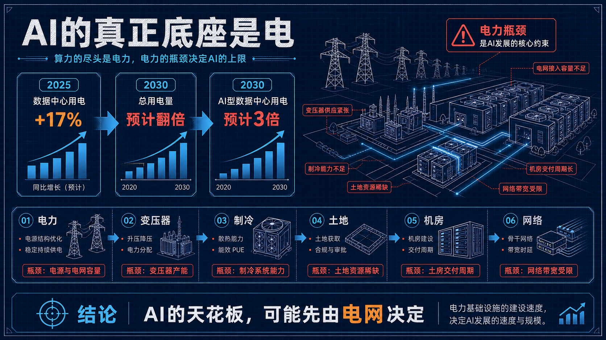
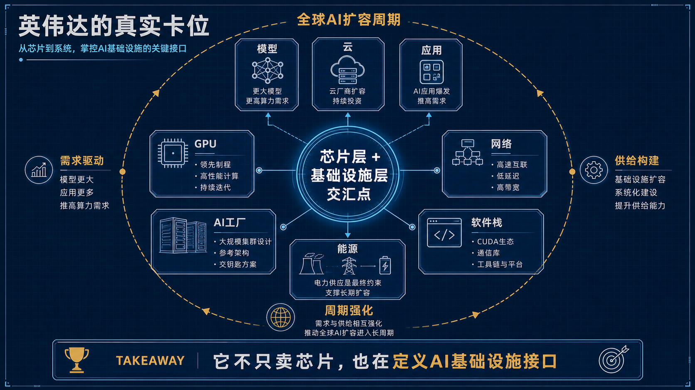

看懂英伟达“五层蛋糕”理论，才能看懂这一轮AI行情的真正主线
---

**导语**

过去两年，AI最热闹的部分，始终在模型层。  
谁更聪明，谁更像人，谁能写代码，谁能做Agent，几乎占据了全部讨论中心。

但如果把视角稍微拉远一点，就会发现，真正改变产业格局的，未必是模型本身，而是模型之下那条越来越沉重、越来越昂贵、也越来越清晰的供给链。

黄仁勋最近提出的“5层蛋糕理论”，之所以值得重视，不是因为它提供了一个新概念，而是因为它精准点出了这一轮AI竞争的核心矛盾：

**表面在卷模型，底层在卷产能。**

如果说过去的互联网竞争，主要争夺的是流量入口和产品形态；那么这一次AI竞争，正在越来越明显地演变成一场关于电力、芯片、网络、数据中心和资本开支的综合竞赛。

而这，恰恰也是理解英伟达、理解大厂财报、理解AI投资主线最关键的一把钥匙。

---

## 一、黄仁勋的“5层蛋糕”，到底在解释什么？

黄仁勋在`2026年3月10日`发布的文章中，把AI概括为一个五层结构：

**能源 -> 芯片 -> 基础设施 -> 模型 -> 应用**

如果只看字面，这个结构并不复杂。  
但它真正重要的地方在于，它把AI从“一个更聪明的软件系统”，重新定义成“一个持续消耗资源、持续投入资本、持续建设底层设施的工业体系”。

这意味着，AI的逻辑和传统软件已经不完全一样。

传统软件最典型的特征，是边际成本低。产品一旦做出来，复制给更多用户，新增成本相对有限。因此，资本市场会更关注用户增长、订阅收入、留存率和利润率改善。

但AI不同。

AI不是一次性写好的程序，而是一种需要持续调用算力、消耗电力、依赖网络和数据中心运行的“实时智能生产系统”。无论是训练模型，还是推理调用，背后都需要底层供给链不断运转。

所以在“五层蛋糕”里：

- **能源层**，决定AI扩张最终受什么约束
- **芯片层**，决定电力向计算能力的转化效率
- **基础设施层**，决定算力是否能大规模交付
- **模型层**，决定智能能力的上限
- **应用层**，决定商业价值的兑现速度

这个框架最有价值的地方，是让我们意识到：

**AI的竞争，不只是技术性能竞争，更是供给能力竞争。**

---

## 二、从最新财报看，AI产业的核心问题已经变了

过去，市场最担心的是AI有没有真实需求。

这个问题到今天，基本已经有了越来越明确的答案。

截至`2026年5月31日`，几家全球科技巨头披露的最新数据，几乎都在指向同一个事实：

**AI需求已经不是问题，真正的问题正在变成谁能更快交付、谁能更稳扩产。**

### 1. 英伟达：它受益的不是单点爆发，而是整条链条进入扩容期

英伟达最新财报显示，`2027财年第一季度`公司营收达到`816亿美元`，同比增长`85%`；其中数据中心收入达到`752亿美元`，同比增长`92%`。

更值得注意的是两个细节。

一是数据中心计算收入达到`604亿美元`，而数据中心网络收入达到`148亿美元`，同比增长`199%`。这说明英伟达受益的已经不只是GPU本身，而是正在向更广义的数据中心系统能力延伸。

二是公司给出的下一季度营收指引达到`910亿美元`，并且明确表示，**这一指引没有假设来自中国的数据中心计算收入**。

这意味着，即使剔除部分受限市场，全球AI基础设施需求依然足够强，能够支撑英伟达维持极高增长。

换句话说，英伟达今天的高景气，不只是“某几个模型公司训练得更猛”，而是全球AI产能建设正在系统性放量。

### 2. 微软：最稀缺的不是客户，而是可交付产能

微软在`2026财年第三季度`电话会上披露，其AI业务年化收入已经超过`370亿美元`，同比增长`123%`。同期资本开支达到`319亿美元`，其中大约三分之二用于短生命周期资产，主要是`GPU和CPU`。

与此同时，Azure收入增长`40%`，管理层明确表示：**客户需求继续超过可用产能。**

这句话很关键。

它意味着，当前AI云服务的主要矛盾，已经不是产品教育用户，也不是证明商业可行性，而是供给端建设速度跟不上需求释放。

对投资者来说，这种变化会直接影响估值逻辑。因为一旦需求侧被验证，市场定价就会从“渗透率提升”转向“扩产效率和交付能力”。

### 3. Alphabet：AI已经推动云厂商进入新一轮重资本周期

Alphabet在`2026年4月29日`披露，一季度Google Cloud收入同比增长`63%`，首次单季突破`200亿美元`，backlog超过`4600亿美元`。

与此同时，公司将`2026年全年资本开支指引`上调至`1800亿到1900亿美元`，一季度CapEx达到`357亿美元`。

如果说Cloud高增长说明了需求，那么CapEx的大幅提升说明了另一件事：

**AI正在推动云厂商重新进入高强度基础设施投入周期。**

短期看，这会压制部分自由现金流和利润表现；但中长期看，谁先完成产能建设，谁就更可能在下一轮AI服务竞争中占据核心位置。

### 4. Meta与亚马逊：AI正在重塑财务结构

Meta将`2026年资本开支指引`从`1150亿到1350亿美元`上调至`1250亿到1450亿美元`，原因包括更高的组件成本以及未来数据中心容量需求。

亚马逊方面，`2026年第一季度`AWS收入同比增长`28%`至`376亿美元`，为15个季度以来最快增速。与此同时，公司过去12个月自由现金流降至`12亿美元`，而去年同期为`259亿美元`。亚马逊明确表示，导致这一变化的主要原因，是物业和设备采购同比增加`593亿美元`，而这部分增长**主要反映AI投资**。

这组数据说明，AI对科技巨头的影响已经不再停留在产品层面，而是开始实质性改变它们的资本结构、现金流结构和投资节奏。

也就是说，AI不是一个轻盈的“软件升级故事”，而是一场资本密集型扩张。

---

## 三、为什么真正的主线不在模型，而在模型下面？

如果站在舆论场看，模型层无疑是最具话题性的。  
但如果站在产业兑现和财务验证的角度看，最先形成确定性的，往往是中下层。

原因很简单。

模型层的竞争格局变化极快，应用层的商业模式也还在不断试错。今天的领先者，未必能稳定保持领先；今天的爆款产品，也未必能形成足够深的利润壁垒。

但底层不同。

只要AI需求持续增长，底层就一定会先表现为：

- 更多芯片采购
- 更多服务器和交换网络建设
- 更多数据中心扩容
- 更多电力与冷却系统投入
- 更多资本开支上升

这类需求的特点是可量化、可验证、可进入财报。

因此，市场会更早、更直接地给这些环节定价。

这也是为什么这一轮AI行情里，最先被反复验证的，不是某一个应用的长期商业模式，而是英伟达、光模块、交换网络、电力设备、数据中心建设等更偏基础设施的链条。

---

## 四、能源问题，可能比很多人想得更重要

“五层蛋糕”里最容易被忽略的一层，其实是最底部的能源。

国际能源署IEA在`2026年5月`最新分析中指出：

- `2025年`全球数据中心电力需求增长了`17%`
- AI型数据中心增长速度更快
- 到`2030年`，数据中心总用电量预计翻倍
- AI相关数据中心用电预计增长到原来的`3倍`
- 五家大型科技公司`2025年`资本开支已超过`4000亿美元`
- `2026年`预计还将继续增长约`75%`

这说明，AI产业链已经开始从“算力紧张”向“系统资源紧张”演变。

未来真正制约AI扩张速度的，未必只是GPU供应，也可能包括：

- 电力容量
- 变压器和输配电设备
- 制冷与散热系统
- 土地与审批
- 数据中心建设周期
- 网络与光通信链路

也就是说，AI正在变成一个跨能源、半导体、通信和云基础设施的复合型产业主题。

从这个角度看，黄仁勋所谓的“五层蛋糕”，并不是在强调某个单点技术，而是在强调：

**AI本质上是一整套供给体系。**

---

## 五、这对英伟达意味着什么？

从“五层蛋糕”的产业位置看，英伟达的意义已经不能只用“GPU龙头”来概括。

它的价值更深层地来自于，它位于芯片层与基础设施层的交汇点，并且还在持续向上、向外延伸。

今天的英伟达，受益的不只是模型训练需求，而是整个AI工业化过程中的多个关键环节：

- 更高密度的计算需求
- 更复杂的网络与互连需求
- 更庞大的AI工厂编排需求
- 更广泛的云厂商与企业部署需求

这也是为什么，英伟达的溢价并不完全来自短期业绩爆发，而来自市场对其角色的重新定义：

**它不仅在卖芯片，也在参与定义AI基础设施的标准接口和扩容路径。**

当然，英伟达并非没有风险。  
长期仍需要关注自研芯片推进、资本开支持续性、推理效率变化以及地缘和监管因素。

但至少从当前阶段的数据看，行业还处在供给紧平衡状态，而非需求衰退状态。这意味着，对英伟达而言，景气的基础目前依然稳固。

---

## 六、对投资者来说，最重要的问题不是“哪个模型最强”

真正重要的问题是：

**利润会先沉淀在哪一层？**

这是“五层蛋糕”给市场最重要的启发。

因为AI产业里，热度、利润和护城河，很可能分布在不同层级。

- 热度通常在模型和应用层
- 利润往往更早在芯片和基础设施层体现
- 护城河则更可能沉淀在标准、生态和供给能力最强的环节

因此，理解AI投资，不能只看模型榜单，也不能只看产品演示。

更关键的是看：

- 资本开支流向哪里
- 哪些环节出现持续积压的订单与backlog
- 哪些供给能力短期不可替代
- 哪些资产已经从“可选投入”变成“必需投入”

从这个意义上说，黄仁勋提出“五层蛋糕”，并不是在给AI讲故事，而是在给资本市场提供一个更接近产业现实的分析框架。

---

## 结语

如果只从模型能力理解AI，很容易高估上层变化的速度，也容易低估底层供给的约束。

而“五层蛋糕”真正重要的地方在于，它提醒我们：

**AI不是一个孤立的软件创新，而是一轮完整的产业链重构。**

在这场重构里，模型与应用依然是表层焦点；但真正决定扩张速度、利润兑现顺序与估值中枢的，往往是更底层的能源、芯片和基础设施。

这也解释了为什么，当前这一轮AI行情，表面看是一场智能革命，实质上更像是一场全球基础设施重估。

---

## 金句摘录

> AI的核心矛盾，正在从“模型能力差距”转向“基础设施供给能力”。

> 表面最热闹的是模型，最先兑现利润的往往是底层。

> 这一轮AI不是轻资产软件故事，而是资本开支驱动的工业化扩张。

> 英伟达受益的不是单一模型爆发，而是整个AI供给体系进入扩容周期。

> 看懂“五层蛋糕”，本质上是在看懂AI利润最终沉淀在哪一层。

---

## 互动话题

你更认同哪种判断？

**未来3年，AI产业最大的瓶颈，会是模型能力，还是能源与基础设施供给？**

欢迎在评论区聊聊你的看法。

---

## 数据来源

- 英伟达《AI Is a 5-Layer Cake》与中文博客  
  [NVIDIA Blog](https://blogs.nvidia.com/blog/ai-5-layer-cake/)  
  [NVIDIA 中文](https://blogs.nvidia.cn/blog/ai-5-layer-cake/)

- 英伟达 `2027财年Q1` 财报，发布日期：`2026年5月20日`  
  [官方财报](https://investor.nvidia.com/news/press-release-details/2026/NVIDIA-Announces-Financial-Results-for-First-Quarter-Fiscal-2027/default.aspx)

- 微软 `FY26 Q3` 电话会，发布日期：`2026年4月29日`  
  [Microsoft Investor](https://www.microsoft.com/en-us/investor/events/fy-2026/earnings-fy-2026-q3)

- Alphabet `2026 Q1` 披露与电话会，发布日期：`2026年4月29日`  
  [SEC 披露](https://www.sec.gov/Archives/edgar/data/1652044/000165204426000043/googexhibit991q12026.htm)  
  [Earnings Transcript PDF](https://s206.q4cdn.com/479360582/files/doc_events/2026/Apr/29/2026_Q1_Earnings_Transcript.pdf)

- Meta `2026 Q1` 财报，发布日期：`2026年4月29日`  
  [Meta Investor](https://investor.atmeta.com/investor-news/press-release-details/2026/Meta-Reports-First-Quarter-2026-Results/default.aspx)

- 亚马逊 `2026 Q1` 财报，发布日期：`2026年4月29日`  
  [Amazon IR](https://ir.aboutamazon.com/news-release/news-release-details/2026/Amazon-com-Announces-First-Quarter-Results/default.aspx)

- IEA 最新分析，发布日期：`2026年5月`  
  [IEA News](https://www.iea.org/news/data-centre-electricity-use-surged-in-2025-even-with-tightening-bottlenecks-driving-a-scramble-for-solutions)
