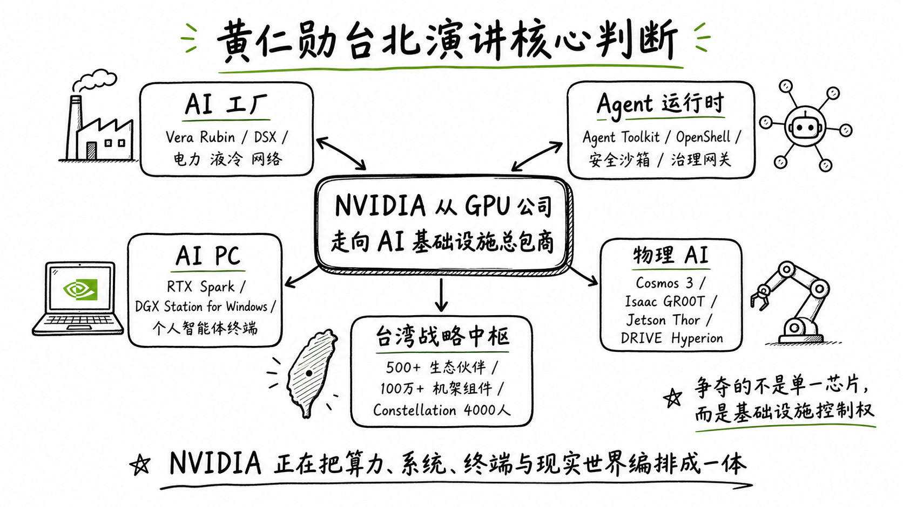
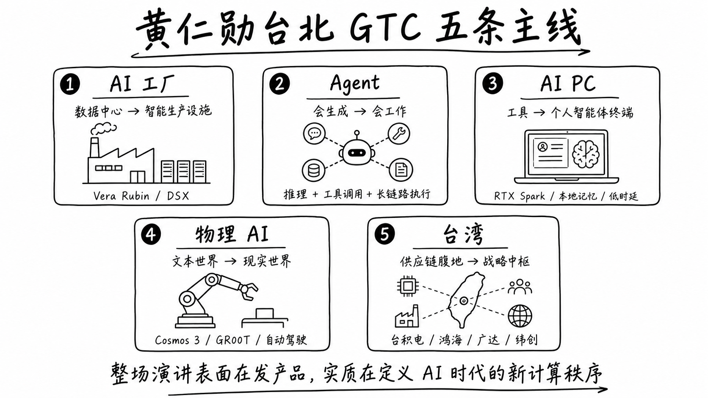
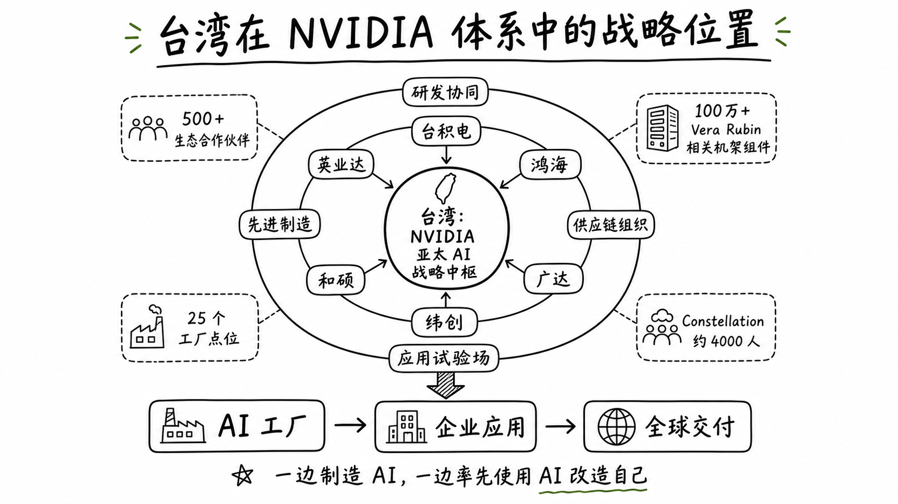
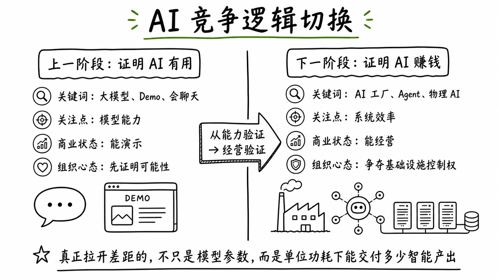

黄仁勋在台北这场演讲，真正要争夺的不是算力，而是 AI 时代的基础设施控制权
---

作者按：

`2026 年 6 月 1 日`，黄仁勋在台北流行音乐中心做了 `NVIDIA GTC Taipei 2026` 主题演讲。整场看下来，我最大的感受不是“英伟达又发了多少新产品”，而是另一件事越来越清晰了：

`黄仁勋正在把 NVIDIA 从一家卖 GPU 的公司，推进成 AI 时代的基础设施总包商。`

这不是修辞，而是现实。

如果说 2023 年到 2025 年，AI 行业的主题还是“证明大模型有用”；那么从 2026 年开始，行业竞争的重点已经明显切换成了另一件事：`谁能真正建起 AI 工厂，谁能把 Token 变成利润，谁能让智能体稳定地跑进企业、终端和现实世界。`

而这，正是黄仁勋这次在台湾最想讲明白的事。

---

## 一、别再把这场演讲理解成“新品发布会”

如果只看表面，这依然是一场标准的 NVIDIA 式发布会。

有新平台，有新模型，有新工作站，有新机器人方案，也有一长串合作伙伴名单。`Vera Rubin`、`DSX`、`RTX Spark`、`DGX Station for Windows`、`Cosmos 3`、`Isaac GR00T`、`DRIVE Hyperion` 这些名字轮番出现，看上去像是一场密集的产品轰炸。

但如果你把它仅仅理解为“又发了一堆卡、又发了一堆系统”，其实会错过重点。

黄仁勋这次讲的真正主线，不是单个产品，而是一个完整的世界观：

`未来的计算中心，不再是软件调用硬件，而是智能体驱动基础设施。`

过去的 IT 架构里，人是流程起点。人打开软件，人点击按钮，人发起查询，人决定下一步。

而在黄仁勋描绘的 AI 世界里，起点正在变化。人只提供目标，接下来由 Agent 去调用模型、读取数据、访问工具、执行流程、协调系统，最后交付结果。

这就意味着，未来最重要的竞争，不只是“谁的模型更强”，而是：

- 谁的基础设施能承载更多推理任务
- 谁的系统能把功耗、散热、网络和吞吐调到最优
- 谁能提供更稳定的 Agent 运行环境
- 谁能把 AI 从演示状态，推进到经营状态

从这个角度看，黄仁勋这次不是在卖芯片，而是在定义一种新的计算秩序。

---

## 二、整场演讲其实只讲了五件事

内容很多，但真正的主线可以压缩成五条。

### 1. AI 工厂正在取代传统数据中心

黄仁勋反复强调，企业今天要买的不是服务器，而是 `AI Factory`。

这个提法的关键，不在字面创新，而在商业含义的变化。传统数据中心本质上是 IT 成本中心，它支撑业务，但不直接生产“可出售的智能”。而 AI 工厂不一样，它被定义成一种可以持续产出 Token、推理结果、自动化流程与数字劳动力的生产设施。

NVIDIA 在这次台北 GTC 上重点推进了 `Vera Rubin` 量产与 `DSX` 架构。按照官方说法，Vera Rubin 已进入全面量产阶段，背后依托 `350+` 座工厂和 `30` 个国家的供应网络；台湾本地就有 `150` 家合作伙伴参与相关制造与协作。另一边，DSX 则更像一套“AI 工厂施工蓝图”，帮助基础设施建设者围绕电力、液冷、网络、机柜和运维来搭建下一代算力设施。

这其实是在告诉市场一件事：

`未来限制 AI 扩张的，不只是芯片数量，而是单位电力预算下，你到底能生产出多少智能。`

所以，英伟达现在卖的不只是性能，而是“每一度电对应多少推理产出”。

### 2. Agent 才是下一轮算力爆发的真正发动机

过去两年，大家都在谈生成式 AI；但黄仁勋这次更强调的是 `Agentic AI`。

这是一个非常关键的转向。

生成式 AI 解决的是“会不会生成内容”的问题，推理模型解决的是“会不会更好地思考”的问题，而智能体要解决的是“会不会真的开始工作”的问题。

一旦 Agent 开始接管企业中的部分任务，计算负载就会发生根本变化。过去多数请求是用户主动发起、一次性交互完成；未来则会出现大量持续运行、跨工具调用、长链路执行的任务。它们不仅更吃推理资源，也更依赖稳定的运行时、安全边界和治理机制。

所以 NVIDIA 这次补的，不只是算力层，也包括智能体时代的运行环境。它在台北强调了 Agent Toolkit、OpenShell、安全沙箱、治理网关等能力，目的很明确：`不只要占住训练和推理的入口，还要占住 Agent 真正跑起来之后的系统入口。`

说得直白一点，黄仁勋正在争的不只是“AI 用什么芯片”，而是“AI 用什么方式工作”。

### 3. AI PC 的目标不是换电脑，而是换掉“电脑的定义”

AI PC 这个词，过去一年已经被说得有点泛了。很多厂商都在讲 NPU、端侧模型、本地算力，但大多还停留在硬件升级叙事里。

黄仁勋这次给出的方向明显更激进。

NVIDIA 在台北发布 `RTX Spark`，并推出从轻薄设备到桌面系统，再到 `DGX Station for Windows` 的一整条产品线。表面上这是在做 AI PC，实际上它想推动的是另一种终端形态：`个人智能体终端`。

未来的 PC，不再只是你打开软件去操作的机器，而是一个长期在线、理解上下文、具备本地记忆、可以低时延执行任务的 AI 节点。它可以读文件、调应用、参与创作、辅助分析，甚至替你完成一部分原本需要手工切换多个窗口才能做完的工作。

如果这个方向成立，那么 PC 行业的估值逻辑都会被改写。因为大家买的就不再是一台更快的电脑，而是一个能持续协作的数字同事。

当然，这里面也有很大不确定性。AI PC 最终能不能成立，并不主要取决于芯片规格，而取决于本地 Agent 是否真的形成高频、刚需、稳定的使用场景。这一点，还需要时间验证。

### 4. 物理 AI 才是最厚的长期市场

这次台北 GTC 里，最值得长期关注的一条线，其实不是模型，而是 `Physical AI`。

从 `Cosmos 3` 到 `Isaac GR00T`，从 `Jetson Thor` 到 `DRIVE Hyperion`，NVIDIA 已经把一条非常完整的路线摆到台面上了：让 AI 从会写、会看、会说，走向会感知现实、理解物理约束、完成动作决策，并最终进入制造、物流、机器人与自动驾驶。

为什么这条线重要？

因为文本 AI 带来的首先是效率红利，而物理 AI 带来的往往是更硬的经营结果：减少停机、提升良率、优化路径、降低人力风险、提高设备利用率。这些结果能直接进入企业利润表，所以商业价值更扎实，支付意愿也通常更强。

很多人今天还把机器人、自动驾驶、工业仿真看成分散市场，但在 NVIDIA 的叙事里，它们其实共享同一种底层逻辑：`云端 AI 工厂训练世界模型，企业与终端通过 Agent 执行任务，边缘设备在真实世界中形成闭环。`

一旦这个闭环成立，NVIDIA 的边界就会变得非常大。

### 5. 台湾不是背景板，而是这套体系的关键节点

很多人看这场演讲，会把台湾当成一个情绪化符号，比如“黄仁勋回到熟悉的地方”“英伟达在亚洲做了一场声量很大的发布会”。

但从产业角度看，台湾绝不是背景板。

它是这场演讲必须发生的地方。

官方材料显示，台湾拥有 `500+` 家 NVIDIA 生态合作伙伴，超过 `100 万` 个 Vera Rubin 相关机架组件在台湾 `25` 个工厂点位协同生产。与此同时，NVIDIA 还公布了台北新园区 `Constellation`，计划容纳约 `4000` 名员工。

这几组信息连起来看，信号非常清楚：

`台湾不只是 NVIDIA 的制造腹地，正在被塑造成其亚太 AI 研发、制造和生态协同的战略中枢。`

更重要的是，台湾企业也不再只是“帮英伟达造机器”。

按照 NVIDIA 官方披露，台积电在用 NVIDIA 技术优化光刻、晶体管与制造仿真；鸿海借助 AI agent 管理制造运营，根因分析速度提升 `80%`、劳动生产率提升 `15%`、设备故障率下降 `10%`；广达、纬创、和硕、英业达等公司，也在把数字孪生和物理 AI 反过来用于自己的工厂体系。

换句话说，台湾供应链一边在制造 AI，一边也在率先使用 AI 改造自己。这使它不再只是生产基地，而开始变成应用试验场。

---

## 三、黄仁勋这次最重要的判断：AI 已经从“证明有用”进入“证明赚钱”

整场演讲如果只提炼一个最关键的判断，我会选这一句：

`AI 的叙事，正在从能力验证转向经营验证。`

过去几年，行业最常见的问题是：

- 大模型到底有没有商业模式？
- 训练是不是太贵了？
- 企业部署是不是噱头大于价值？
- 生成式 AI 会不会最后停留在演示层？

黄仁勋这次在台北给出的回答很明确：这些问题并没有完全消失，但行业重心已经往前走了。

今天真正重要的问题，不再是谁先做出一个惊艳的 Demo，而是谁能把 Token 变成收入，把推理变成流程，把流程变成利润。

所以你会发现，NVIDIA 这次几乎所有发布都在服务同一个命题：

`提高单位功耗对应的智能产出，降低单位任务交付成本，缩短从模型到业务结果的路径。`

这是为什么它要强调：

- `DSX MaxLPS` 在固定电力预算下尽量塞进更多 GPU
- `Vera Rubin` 带来更高吞吐，服务更密集的 Agent 工作负载
- `Nemotron 3 Ultra` 追求更快推理与更低运行成本
- `DGX Station for Windows` 试图把企业级 AI 能力推到桌边

这些动作看似分散，实际上都指向同一个结果：`让 AI 从“能演示”变成“能经营”。`

而一旦这一步成立，算力就不再只是成本，它会被重新理解为一种生产资料。

---

## 四、NVIDIA 正在吃掉 AI 时代最肥的利润池

很多人今天仍然习惯把 NVIDIA 定义成一家芯片公司。这当然没错，但已经不够了。

如果从商业结构看，NVIDIA 正在越过原本属于其他玩家的边界。

传统 IT 时代的利润链条是分散的：

- 芯片厂卖芯片
- 服务器厂卖整机
- 云厂商卖算力
- 软件公司卖 SaaS
- 集成商做部署和交付

而 NVIDIA 正在把这些边界重新揉在一起。

它向上延伸到能源与数据中心设计，因为 AI 工厂首先受制于供电、散热和部署效率。

它向中间延伸到系统与运行时，因为 Agent 需要可治理、可审计、可安全执行的工作环境。

它向下延伸到模型、工具链和行业流程，因为只卖裸算力，迟早会遇到价值被稀释的问题。

它再向外延伸到机器人、自动驾驶、医疗和制造，因为物理世界是下一轮算力需求最确定、也最厚的市场。

于是，NVIDIA 的角色发生了根本变化。

它更像是：

`AI 工厂设计师 + 智能体运行时提供者 + 物理 AI 平台商 + 全球供应链组织者`

这才是黄仁勋这次在台北最强势的地方。他不是在说“我们参数更强”，而是在说：

`未来 AI 产业中最核心的利润，不一定在模型层，也不一定在应用层，而很可能在基础设施编排层。`

如果这个判断成立，那么 NVIDIA 未来的议价权，可能比今天市场想象的还要大。

---

## 五、这场台北演讲，对中文世界意味着什么

如果你是科技从业者、企业管理者，或者长期关注 AI 投资与产业趋势，这场演讲里至少有四个特别值得留意的信号。

### 1. 竞争焦点正在从“模型能力”转向“系统效率”

未来真正拉开差距的，不只是参数规模，也不是单卡性能，而是谁能把电力、散热、网络、存储、运行时、安全与业务流程协同到极致。

单点能力会越来越不够，系统能力会越来越值钱。

### 2. Agent 会倒逼企业软件重写一遍

一旦企业软件开始不仅服务人类 UI，也开始服务 Agent 调用，那么很多底层都会被重构：

- 工作流需要更结构化
- 权限体系需要更细粒度
- 日志与审计必须可追踪
- 数据接口必须更标准化

下一代企业软件，可能首先不是“更好看”，而是“更适合被智能体使用”。

### 3. AI PC 的成败，不在硬件，而在本地智能体是否高频成立

本地运行、低时延、隐私可控、持续记忆，这些特性听起来都成立；但只有当用户真的愿意每天把任务交给本地 Agent，AI PC 才会从概念变成新物种。

如果做不到，它就仍然只是一次换机营销。

### 4. 物理 AI 会是未来三到五年最扎实的产业增量之一

内容生成当然会继续增长，但长期更厚的市场，大概率还是制造、物流、机器人、自动驾驶、能源与医疗，因为这些行业的 AI 回报更容易被量化，也更容易变成真实利润。

---

## 六、黄仁勋真正想定调的是：AI 不再是功能，而是基础设施

为什么黄仁勋的演讲总是值得看？

不是因为他最会讲参数，而是因为他总能把一家公司的商业路线，包装成整个时代不得不接受的基础事实。

而这次台北 GTC 上，他试图确立的新事实是：

`未来的计算单位，不再只是 CPU、GPU、应用程序和云实例，而是一个个持续运行的智能体，以及支撑这些智能体的大规模 AI 工厂。`

这句话一旦被广泛接受，NVIDIA 的位置就会变得异常强大。

因为它刚好横跨了这条链路上的大多数关键层：芯片、网络、系统、机架、运行时、工具链、机器人平台，以及全球制造协同。

所以，黄仁勋这次在台湾真正讲的，不是“新一代显卡”。

他讲的是一套更大的事情：

`AI 正在从一种软件能力，变成一种社会基础设施；而 NVIDIA 正在努力成为这套基础设施的默认建设者。`

---

## 结语

回头看 `2026 年 6 月 1 日` 这场台北演讲，最值得记住的不是某一个参数，也不是某一张路线图，而是一个更大的判断：

`AI 行业已经从“证明可能性”的阶段，进入了“争夺基础设施控制权”的阶段。`

黄仁勋在台湾做的，不只是发布新品，而是把这场争夺讲明白、讲具体、讲到供应链最核心的腹地。

而台湾，也不再只是这个故事的配角。它正在成为全球 AI 工业体系最关键的组装场、试验场和放大器之一。

这或许才是这场 GTC Taipei 2026 最深的一层含义。

---

## 参考来源

1. NVIDIA GTC Taipei 2026 Keynote  
https://www.nvidia.com/zh-tw/gtc/taipei/keynote

2. NVIDIA Blog: GTC Taipei at COMPUTEX: Live Updates on What’s Next in AI  
https://blogs.nvidia.com/blog/nvidia-gtc-taipei-computex-2026-news/

3. NVIDIA Newsroom: NVIDIA Vera Rubin Ramps Into Full Production to Power Agentic AI Factories Worldwide  
https://nvidianews.nvidia.com/news/vera-rubin-full-production-agentic-ai-factory

4. NVIDIA Newsroom: NVIDIA DSX Gives Infrastructure Builders the Playbook for AI Factories  
https://nvidianews.nvidia.com/news/dsx-infrastructure-ai-factory

5. NVIDIA Newsroom: NVIDIA and Microsoft Reinvent Windows PCs for the Age of Personal AI  
https://nvidianews.nvidia.com/news/nvidia-microsoft-windows-pcs-agents-rtx-spark

6. NVIDIA Newsroom: NVIDIA DGX Station for Windows Puts a Trillion-Parameter AI Supercomputer on Every Enterprise Desk  
https://nvidianews.nvidia.com/news/nvidia-dgx-station-for-windows-puts-a-trillion-parameter-ai-supercomputer-on-every-enterprise-desk

7. NVIDIA Newsroom: NVIDIA Launches Cosmos 3, the Open Frontier Foundation Model for Physical AI  
https://nvidianews.nvidia.com/news/nvidia-launches-cosmos-3-the-open-frontier-foundation-model-for-physical-ai

8. NVIDIA Newsroom: NVIDIA Announces NVIDIA Isaac GR00T Reference Humanoid Robot for Academic Research  
https://nvidianews.nvidia.com/news/nvidia-announces-nvidia-isaac-gr00t-reference-humanoid-robot-for-academic-research

9. NVIDIA Newsroom: NVIDIA DRIVE Hyperion Becomes the Global Platform for a Robotaxi-Ready World  
https://nvidianews.nvidia.com/news/nvidia-drive-hyperion-becomes-the-global-platform-for-a-robotaxi-ready-world

10. NVIDIA Newsroom: NVIDIA and TSMC Bring AI Into Fabs to Advance Semiconductor Design and Manufacturing  
https://nvidianews.nvidia.com/news/nvidia-and-tsmc-bring-ai-into-fabs-to-advance-semiconductor-design-and-manufacturing

11. NVIDIA Blog: Taiwan’s Industry Titans Turbocharge World’s AI Infrastructure Buildout With NVIDIA  
https://blogs.nvidia.com/blog/taiwan-ecosystem-ai-infrastructure/
